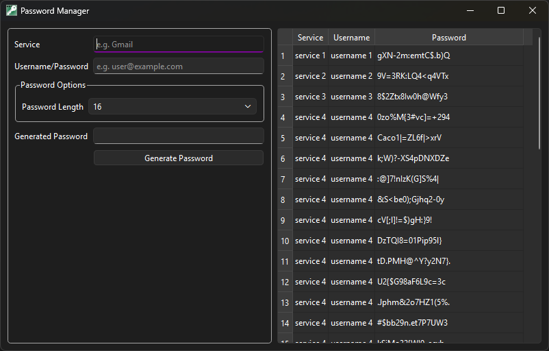

# Password Manager

This is a off-line desktop app based simple password manager with a graphical user interface. It creates random password combinations and stores the created password (along with other relevant information, such as username/email)
in a csv-file.

Moin Ahmed 2026

### Attribution Notice

"This software uses Qt. Qt is available under the GNU Lesser General Public License (version 3). The Qt Toolkit is Copyright (C) The Qt Company Ltd. and other contributors."

## Screenshots

